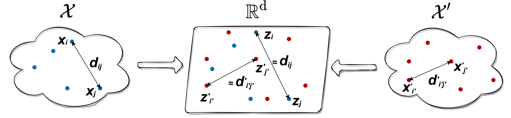

# Joint Multidimensional Scaling

The repository implements the Joint Multidimensional Scaling (Joint MDS) described in the following paper:

>Dexiong Chen, Bowen Fan, Carlos Oliver, Karsten Borgwardt.
[Unsupervised Manifold Alignment with Joint Multidimensional Scaling][1]. Preprint 2022.

Joint MDS is a an approach for unsupervised manifold alignment, which maps datasets from two different domains without any known correspondences between data instances across the datasets, to a common low-dimensional Euclidean space. Joint MDS integrates Multidimensional Scaling (MDS) and Wasserstein Procrustes analysis into a joint optimization problem to simultaneously generate isometric embeddings of data and learn correspondences between instances from two different datasets, while only requiring intra-dataset pairwise dissimilarities as input.



## Installation

The dependencies are managed by [miniconda](https://conda.io/miniconda.html)

```
python=3.9
numpy
scipy
pytorch=1.9.1
scikit-learn
pandas
```

To start with the package, run

```bash
export $PYTHONPATH=$PWD
```

## Citation
Please use the following to cite our work:

```bibtex
@article{chen2022jointmds,
  url = {https://arxiv.org/abs/2207.02968},
  author = {Chen, Dexiong and Fan, Bowen and Oliver, Carlos and Borgwardt, Karsten},
  title = {Unsupervised Manifold Alignment with Joint Multidimensional Scaling},
  journal={arXiv preprint arXiv:2207.02968}
  publisher = {arXiv},
  year = {2022},
}
```


## Usage

The usage of Joint MDS is similar to the [MDS](https://scikit-learn.org/stable/modules/generated/sklearn.manifold.MDS.html) function in scikit-learn.
Here is one minimal example of Joint MDS. 

```python
from joint_mds import JointMDS
import numpy as np

D1 = np.random.rand(128, 10)
D2 = np.random.rand(64, 20) 

JMDS = JointMDS(n_components=2, dissimilarity="eculidean")
Z1, Z2, P = JMDS.fit_transform(D1, D2)

print(Z1.shape) # (128, 2)
print(Z2.shape) # (64, 2)
print(P.shape)  # (128, 64)
```

## Reproducing results in our paper

#### Data

All our experimental scripts are in the folder `experiments`. So to start with, first run 

```bash
cd datasets
bash get_data.sh
```

Then `cd ../examples`

#### Joint visualization and unsupervised heterogeneous domain adaptation

For sythetic datasets, run

```bash
python example_simulation.py --dataset s1 --components 2
```
The dataset can be either `s1`, `s2` or `s3` respectively for bifurcation, Swiss roll and circular frustum.

For real-world datasets, run

```bash
# scGEM
python example_scGEM.py --components 2

# SNAREseq
python example_SNAREseq.py --components 2

# MNIST-USPS
python example_mnist_usps.py --components 2
```

#### Graph matching

For PPI network matching, the target graph has 5%, 15% or 25% additonal noisy edges. For example, for matching 5% noise graph, run
```bash
python example_matching_PPI.py --noise 5
```

For MIMIC graph matching task, run
```bash
python example_matching_MIMIC.py
```
#### Protein structure alignment

Run

```bash
python example_protein_alignment.py
```

For all paramters in Joint MDS please refer to `joint_mds.py`.


[1]: https://arxiv.org/abs/2207.02968